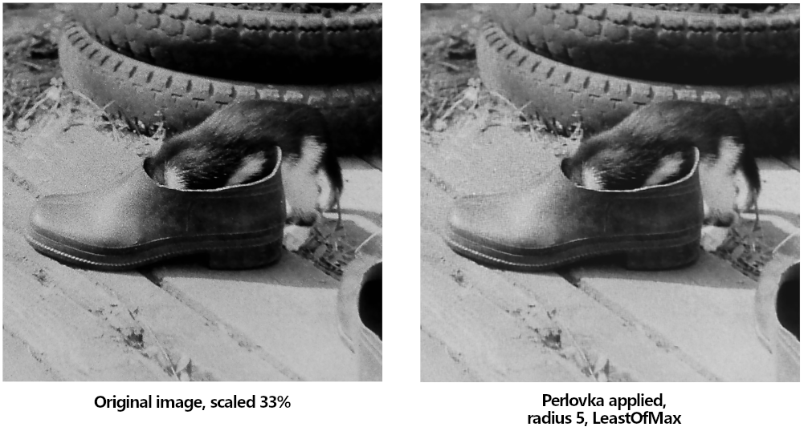
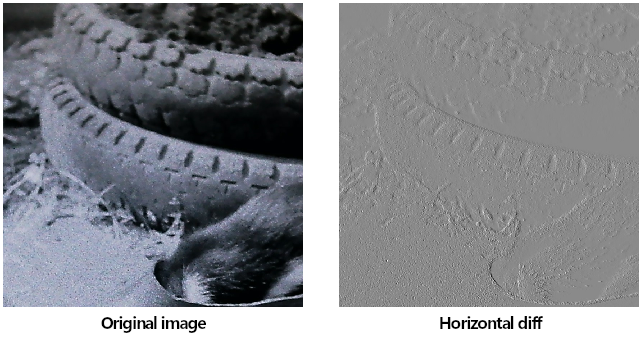
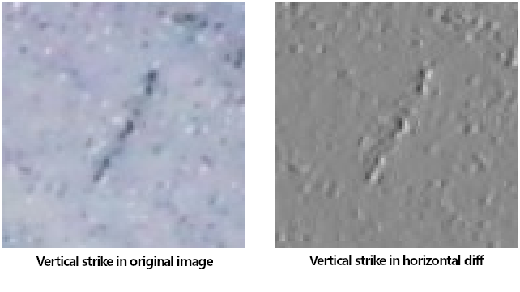
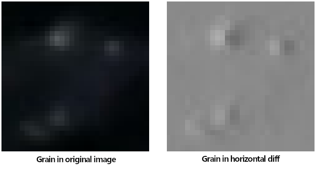
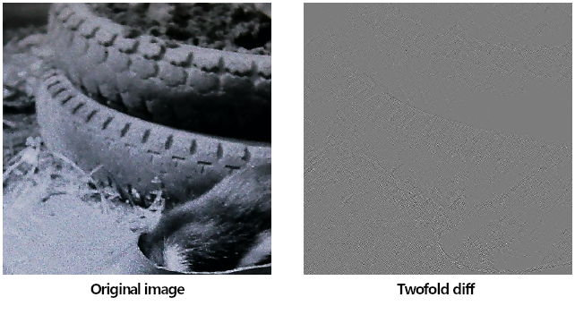
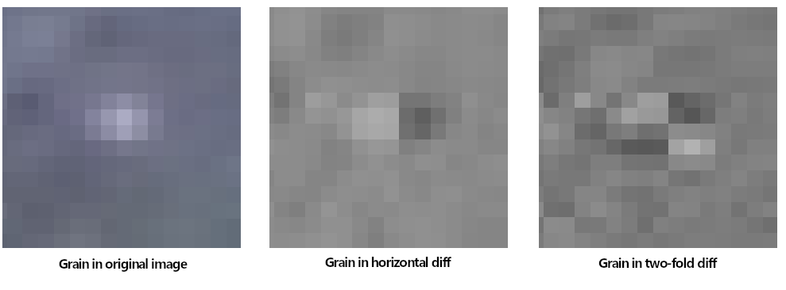
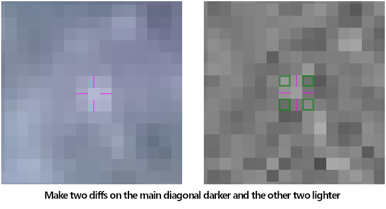

# Perlovka README

This repository contains Perlovka filter implementation for GIMP.

The filter reduces granularity level in photo images. You may see examples here: [original image](./docs/00-original.png) and one with the [filter applied](./docs/01-denoized.png).

## Advantages and Drawbacks

This filter does not smooth image or damage it on light or moderate settings when the pattern is not too motley. Granularity generally looks remarkably paler when the filter applied and some grains are removed without a trace.

The algorythm is not resource intensive on light and moderate settings. Aggressive settings can save badly injured images but with a penalty: result would never be ideal.

Perlovka is not intended to repair chroma noize. The GEGL implementation repairs isolated luminance channel in color images and does not damage chroma.

## Installation

### Requirements for Building GIMP-2.0 Plug-in

In order to build and install the filter `gimptools-2.0` package required along with C compiler (GCC, Cygwin64).

To install run the following:

~~~sh
make
make install
~~~

### Requirements for Building GEGL-0.4 Plug-in

* Development package for `gegl-0.4`.
* Meson build tools.

~~~sh
mkdir _build
cd _build
meson setup ..
ninja
~~~

Copy `perlovka.o` or `perlovka.dll` to GEGL plugins directory.

## Description

Perlovka studies and makes correction in twice differentiated image. First it calculates horizontal differences of the image luminance channel: each element of the resulting array is the value of the corresponding pixel minus the one on the left. Then the horizontal diff is differentiated once more - vertically (by columns).

Granulation blot in the resulting array is represented by specific chequered pattern: four symmetrical pixels around a guilty one are declined from zero so that the two on one diagonal are positive while the other two are negative.

Values of the four chequered pixels are then mutually compensated: those below zero are increased and those above zero are decreaseed by the same delta. This symmetric compensation has such effect that the change affects only involved area between the pixels and does not damage the rest of the image when it is restored from the twice-diffed data.

When the compensation is over the two-fold diff is differentiated the other way back: first by columns, then by rows.

## Explanation

Horizontal difference of an image (of a luminance channel to be exact) contains both negative and positive values along with zeros. Overall view of this data is impossible until the values are raised by say half a byte to get rid of negatives. If we do that and build an image from the data we'll see something like that:

Most area of the image is grey but objects on the original image leave perfectly visible contours on the diff-picture. Transition from dark to light on the image leaves light strip on the diff and vice verca.

Soft and long gradient is represented by wide stripe which is slightly lighter (or darker) then the overall grey. Quick and high transition leaves bright narrow stripe.

Dark stripe on the light background of the image leaves two parallel stripes on the diff: first dark then light.

This apparition is obvious if we remember that going along the pixels row we meet first light-to-dark front (from background to the stripe) then the reverse: from the dark of the stripe back to the background.

A dot or a small blot on the image behaves likewise. It builds the same very blot but consisting from two halves on the diff-picture: one light and one dark.

If the horizontal diff-picture is differentiated then vertically the contours mostly degrade but the grains receive more specific manifestation. Any of them can be recognized by chequered pattern: two diagonal quadrants around the grain's center are dark and the other two are light.

Trying to remove the just detected grain on the original image is not a stright-forward task. One can reconstruct the background under the grain: take pixels around it, build a system of linear equations and extrapolate values in damaged area. This would give ideal result but only in ideal conditions: area around must be absolutely sound, grains must not fuse with each other and the background must be homogenous. These conditions are rarely met and such approach would damage the image in most cases.

Perlovka edits the twice-diff picture instead. Since differentiation is reversable the original image can be restored from the diffs at 100% accuracy.

When a pixel is changed on the diffs-picture two stripes will appear on the restored image: one going right and one down. They look like shadows cast by the edited pixel.

In order to prevent this artefact four pixels must be changed at the same time. All of the pixels must lay in the corners of the same box. The two opposite one another are changed in one direction, the other two in reverse by the same value. This approach makes two borders of the box formed by "the four" lighter and the other two darker - exactly what we need.

## Behaviour and Settings

### Radius

Grains are rarely limited by area 3 x 3 pixels. The `Radius` setting allows to extend grain pattern search radius to the required one. Radius value of 5 is generally more than enough. Setting it higher hardly gives any benefit in most cases but neither brings it penalties.

> High radius does not reduce performance since values further from the pixel which is being worked on at the moment are discarded from consideration if the closer ones do not need compensation.

### Iterations

`Iterations` setting allows to limit number of grain reduction iterations. The two-fold diff is studied and fixed repeatedly several times until the number of the found grains is zero. Reason for this is our intervention: fixing one grain may create conditions for the neighbouring one to appear.

When the grain detection is not aggressive the iterations limit is converged: number of found grains diminishes whith every iteration and meets zero in the end. This generally requires 5-8 iterations.

When grain detection and compensation are aggressive the iterations limit does not converge and requires a limit: the `Iterations` setting.

### Grid

The grain center may happen at a pixel's center. In this case it will be intercepted by the *Odd* `Grid`.

But this grid would fail to detect grain centered between pixels. This condition requires *Even* grain resolver.

To deal with the both grain centrations the *Both* setting for `Grid` can be used. This requires twice the time amount to resolve the image but gives better results.

General recommendation is to try the *Odd* grid centration and resort to the *Both* when the result is not satisfying. For less aggressive grain detection the *Both* grid may be used from the start.

### Matching

This setting along with `Resolver` defines grain detection and compensation greedyness (aggressivity).

The *Strict* matching conforms to the algorythm described above: two diffs around the studied pixel must be strictly positive, another two - negative.

The *Soft* mode allows one single diff value to be zero in order to trigger grain compensation mechanizm.

### Resolver

This setting defines compensation delta detection method. When the delta resolving method is *Minimal* neither of the four diffs changes its' sign. Delta is defined by the value which is closest to zero.

The *Maximal* resolver takes as delta the furthest from zero value. This compensation method is the most damaging. It may (arguably) change the grain intensivity to the reversed one. Anyway, it shoud be used only in badly noized images in a hope that the result would be less disgusting than the original image.

The other two delta resolving methods are between the *Minimal* and *Maximal* ones by effect. The *Largest of Min* is generally more damaging from the two but allows to imbibe some life in badly damaged images.

The *Strict* `Matching` is generally makes sence only when coupled with *Minimal* resolver. The other three resolvers have generally more expressed result with the *Soft* matching, behave more aggressively in such combination and are intended for moderate or hard granularity.

The three resolvers except the *Minimal* require more time to work, especially when *Soft* matching is selected.

### Field Matching

When this checkbox is off classical comparison is enacted: only one comparison for a specific radius. The four pixels are arranged in the vertices of a square box.

The `Field matching` on compares all the "fours" for the radius. That is three comparisons on radius 2, five on radius 3 etc.

The setting is more or less experimental and has been added with consideration that grain may have not only perfect round form but be alongated or altogether irregular. It does not make sence to turn it on in most situations but can be considered when all other means to repair the image are fruitless.
